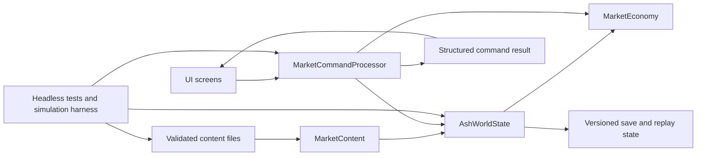

# Market of Ash — GPT Agent Development Handoff Roadmap

**Owner:** Product lead and GPT implementation agent  
**Target:** A coherent, testable Five-Well Basin alpha for structured external playtests  
**Operating principle:** Build the smallest complete campaign that proves the trade-and-travel fantasy. Do not broaden the game to disguise a weak core loop.

> **Product promise:** *Market of Ash is a 2D illustrated trade-and-travel RPG in which a small caravan crosses a recovering ashland, turning volatile local needs into profit, trust, and difficult choices while every cheap route creates a new vulnerability.* [1]

This roadmap is a persistent operating document, not a request to implement every system at once. The GPT agent should receive the charter in Section 2 as standing context, then receive **one numbered slice at a time** from Section 6. A slice is complete only when its player-facing behavior, data shape, command rules, UI feedback, tests, save behavior, and documentation agree.

## 1. Current Baseline

The repository already contains a narrow but real playable spine. A player can launch from a main menu, enter the Ashgate settlement shop, inspect explainable prices, buy/sell cargo, open a separate departure map, compare a legal route, commit travel, observe a route result, enter the arrival settlement, and sell cargo. The prototype uses a deterministic seed, command/result processing, versioned saves, canonical runtime content, and headless tests.

| Baseline area | Current implementation | Handoff instruction |
| --- | --- | --- |
| **Runtime content** | `content/runtime_world.json` defines six goods, five settlements, three routes, route endpoints, and planning assumptions. | Extend content with stable IDs and validator coverage; do not recreate the same facts in UI scripts. |
| **Simulation** | `AshWorldState`, `MarketContent`, `MarketEconomy`, and `MarketCommandProcessor` own state, data access, pricing, and validated mutations. | Keep it rendering-independent and deterministic. Add explicit commands rather than direct UI mutation. |
| **Player flow** | Main Menu → Settlement Shop → Departure Desk / Map → arrival report → destination shop. | Preserve the screen distinction: shop is local trade; map is travel commitment. |
| **A0–A1** | Command/result boundary, content validation, route endpoints, price reasons, regional comparison, and route-profit preview are present. | Treat these as contracts; refactor only with an ADR and regression tests. |
| **Known calibration issue** | The forecast deducts value-based expected loss, while the resolver removes one cargo unit. The forecast is materially conservative for large loads. | Fix this before relying on player forecast comprehension or broad balance conclusions. |
| **Automated simulation** | A read-only 100-seed policy harness and report exist under `tools/` and `research/playtest_simulation/`. | Rerun after any economy, event, route, contract, or crisis change; do not balance by intuition alone. |
| **Known intentional gaps** | Market memory, services, contracts, crew, event choices, factions, arms consequences, full crisis arc, endings, controller/accessibility depth, and Windows alpha operations are incomplete. | Add these only in the dependency order below. |

## 2. Persistent Charter for the GPT Agent

Use the following prompt as persistent context in every new agent session.

```text
You are the lead implementation agent for Market of Ash, a Godot 4.x premium single-player Windows game. Read, in order: design/design_prompt.md, README.md, AGENTS.md, docs/decision_log.md, docs/implementation_status.md, docs/ux/alpha_experience_flow_spec.md, and the smallest relevant source/test files before editing.

The game is a compact trade-and-travel RPG inspired by the useful rhythm of Frontier: inspect a local market, form a trade plan, deliberately commit to travel, face a legible consequence, arrive in a changed place, and reinvest. Do not copy Frontier assets, layout, or dated interface complexity.

The central decision is: “Do I take the cheap exposed road with valuable cargo, the expensive safe road with a smaller margin, or a relationship-building plan that changes what this region becomes?” Commerce remains the main verb. Politics, crew, and events must deepen the next trade or route decision rather than become separate games.

Non-negotiables:
1. Keep simulation deterministic, data-driven, serializable, and independent of rendering.
2. UI may read state and emit commands; it must not calculate prices, validate routes, mutate factions, resolve events, or migrate saves.
3. Every important number must have a concise reason or comparison. Every random outcome must have a stated source, preparation option, or recovery path.
4. Failure can cost money, time, cargo, trust, or access, but the first hour must not produce a hidden soft lock or campaign-ending bad-luck state.
5. Never make weapons mandatory, add real-time combat, factories, crafting chains, online markets, multiplayer, a second region, permadeath, microtransactions, or live-service systems during alpha.
6. Preserve Main Menu → Settlement Shop → Departure Desk / Map → Travel / Event → Arrival Report → Settlement Shop. Shop owns local trade; map owns route commitment.
7. Work in one small vertical slice at a time. Before code, state the player behavior, data shape, acceptance criteria, and test plan. After code, run the exact relevant checks and report known limitations.

Every response must contain: Intent; Plan; Changed files; Verification with exact commands/results; Risks; and exactly one next small task. Do not claim a visual or manual test passed unless you actually ran it.
```

## 3. Product Spirit and Decision Tests

The following principles are decision filters. A proposed feature must pass them before implementation. If it does not affect a next cargo, route, contract, relationship, or risk decision, it is probably scope creep.

| Principle | Required player feeling | Implementation test | Rejection signal |
| --- | --- | --- | --- |
| **Trade has place and purpose.** | “I know why this settlement needs this good.” | A player can name a price reason and one plausible destination before purchase. | The market is only a global price spreadsheet. |
| **Travel is a commitment.** | “This route is cheap because it exposes me; the safe option costs something visible.” | Fee, time, provision use, risk source, and consequence are shown before commit. | The map is decorative or travel is a loading screen. |
| **The world remembers.** | “My delivery changed something I will have to live with.” | Delivery changes bounded market pressure, route condition, access, contract availability, or regional state. | Repeating the same trade remains permanently optimal. |
| **Failure teaches and recovers.** | “I can see what went wrong and have a next move.” | The result identifies cost/cause and presents at least one genuine recovery option. | The player restarts because the game hides a required resource or random rule. |
| **People and politics complicate trade.** | “This contact or faction changes what I can profitably and safely do.” | Every crew/faction effect changes a price, route, information, access, contract, or event option. | Characters are interchangeable stat bonuses or lore menus. |
| **Readability outranks simulation density.** | “I understand the meaningful uncertainty.” | Explanations are plain language; hidden variables are either removed or disclosed as uncertainty source. | Formula exposure substitutes for an explanation. |
| **Polish makes consequence felt.** | “I felt the choice land.” | Resource deltas, map/settlement changes, banner/route/NPC feedback, and restrained sound/animation reinforce state. | Cosmetic motion obscures the plan or delays the action. |

## 4. Architecture and Framework Contract

### 4.1 Ownership boundaries



| Layer | Owns | Must not own |
| --- | --- | --- |
| **`content/`** | Human-authored records, stable IDs, text, route endpoints, tunable bounds, event/contract/crew/faction definitions. | Executable scripts, UI-node paths, or bespoke GDScript expressions in JSON. |
| **`src/core/market_content.gd`** | Loading, copying, validation, cross-reference checks, stable lookup/accessor helpers. | Price calculation, UI text layout, or world mutations. |
| **`src/core/world_state.gd`** | Mutable campaign state, deterministic seed inputs, command history, serialization, migration, derived caches. | Rendering nodes and input event logic. |
| **`src/core/economy.gd`** | Pure price, route forecast, affordability, capacity, forecast-calibration functions. | Direct state mutation or UI formatting. |
| **`src/core/*_processor.gd`** | Explicit command validation, deterministic resolution, structured success/failure result, state delta, log entry. | Scene manipulation, runtime prompts, or hidden global state. |
| **`src/ui/`** | Screen state, focus, transitions, data formatting, tooltips, accessibility presentation, command emission, result display. | Authoritative business rules or raw content duplication. |
| **`tests/`** | Deterministic fast regression suites and replay fixtures. | Manual-only assertions that cannot be evaluated headlessly. |
| **`tools/`** | Content validation, simulation, build/repro scripts. | Alternate gameplay implementations that drift from the command boundary. |

### 4.2 Required command/result shape

All state-changing actions should follow the current command boundary. Names can be concise, but inputs and results must remain plain serializable data.

```gdscript
# Command
{
    "id": "accept_contract",
    "inputs": {"contract_id": "reedwatch_relief_01"}
}

# Success result
{
    "ok": true,
    "reason": "",
    "message": "Accepted Reedwatch relief delivery. Deliver 4 water by Day 5.",
    "state_delta": {
        "active_contracts": ["reedwatch_relief_01"],
        "reputation": {"free_caravans": 1}
    }
}

# Failure result
{
    "ok": false,
    "reason": "contract requires 4 free cargo space",
    "message": "Contract requires 4 free cargo space.",
    "state_delta": {}
}
```

A command must validate every precondition before mutation. It must append both success and failure to bounded command history. A command with random-looking resolution must derive its outcome from saved deterministic state, such as seed, day, command index, event ID, and explicit resolved roll.

### 4.3 Content and schema rules

Content must use stable lower-snake-case IDs. Names are display data; no core behavior may target a display string. Each new schema receives four artifacts in the same change: a sample valid record, loader/accessor support, validator coverage, and at least one invalid fixture/test.

| Content domain | Minimum fields | Cross-reference rules |
| --- | --- | --- |
| **Good** | `id`, `name`, base value, weight, tags, risk/spoilage behavior where relevant. | Every price/demand table covers valid goods; arms tags require escalation handling. |
| **Settlement** | `id`, name, economic role, production/demand, faction context, local problem, visual/UI identity. | Every route endpoint, contract origin/destination, and event location refers to a settlement ID. |
| **Route** | `id`, name, exactly two endpoints, fee, days, risk, tags, condition, intelligence. | Endpoints differ and exist; UI only lists routes that connect selected origin/destination. |
| **Contract** | `id`, sponsor, origin, destination, cargo requirement, deadline, reward, failure/recovery consequence. | Goods/settlements/factions exist; no contract creates an unwinnable mandatory state. |
| **Crew** | `id`, role, cost/upkeep, limitation, preference/fear, one or more explicit hooks. | Hooks target known commands/events/routes; no generic percentage-only design. |
| **Event** | `id`, trigger predicates, choice IDs, preconditions, deterministic outcome table, result text keys. | Every option has a stated tradeoff; failed preconditions remain legible. |
| **Faction** | `id`, values/bounds, unlock thresholds, effects, visible symbols/text. | Effects change trade/travel/access; no reputation value lacks a player-visible consequence. |
| **Crisis/ending** | stages, triggers, state effects, completion predicates, summary templates. | Stages remain reachable/recoverable; ending predicates are testable from fixtures. |

### 4.4 Save and replay discipline

A save must retain any value that changes future rules or interpretation: content version, save version, seed, day, market memory, route conditions, active contracts, crew/relationships, faction values, crisis stage, resolved event state, upgrades, command history, and ending flags. Add a migration for every breaking state change. Never solve a migration problem by deleting or silently resetting a player save.

The project should maintain a small `tests/fixtures/` set with one fixture per major campaign state: fresh start, saturated market, active contract, event precondition, low-provision recovery, high/low faction access, crisis stage, and near-ending state. Fixtures should be plain, readable serialized dictionaries or JSON.

## 5. Verification Framework

The minimum automated suite grows with the game. Every implementation slice should run its own focused test first, then the shared relevant checks before merge.

| Check | Purpose | Run when |
| --- | --- | --- |
| `godot --headless --path . --script res://tests/test_economy.gd` | Prices, capacity, transaction rules, routes, forecast, save migration, and any core simulation behavior placed there. | Every core/content/economy change. |
| `godot --headless --path . --script res://tests/test_map_ui.gd` | Menu, shop, departure map, focusable primary journey, result screens, no-mutation navigation. | Every UI/scene/flow change. |
| Domain test scripts such as `test_events.gd`, `test_contracts.gd`, `test_campaign.gd` | Isolate the feature’s full decision matrix. | Every corresponding slice. |
| `python3 tools/validate_runtime_world.py --data content/runtime_world.json` and sibling validators | Schema, reference, range, and topology integrity. | Every content schema or record change. |
| `bash scripts/verify.sh` | Repository policy checks. | Before every PR update. |
| `godot --headless --path . --editor --quit` | Project import and project-wide script/scene parse health. | Before every PR update. |
| `godot --headless --path . --export-release Web build/web/index.html` | Browser smoke build; optional development artifact. | UI flow review or Web demo check. |
| Windows export smoke command, once configured | Alpha distribution safety. | Every alpha candidate. |
| `godot --headless --path . --script res://tools/simulate_trade_policies.gd` plus analysis script | Detect dominant routes/goods, ruin loops, risk calibration drift, and policy divergence. | Every economy, route, event, contract, or crisis-tuning PR. |

A UI task needs more than a node-existence test. It must include a scripted path, a manual test card, and a visual review artifact where possible. A simulation task needs more than a chart. It must document assumptions, distinguish policy agents from human players, and state which decision should not yet be balanced from synthetic data.

## 6. Dependency-Ordered Implementation Slices

### Sequencing rule

Do not start a slice until the previous slice’s gate passes. If a gate reveals a comprehension failure, improve the relevant existing surface before adding content breadth. The key questions are whether the player understands an opportunity, sees a tradeoff, experiences a consequence, and can recover—not whether every planned menu exists.

| Order | Slice | Goal | Do not begin until | Gate to advance |
| --- | --- | --- | --- | --- |
| **B0** | Forecast/resolution calibration | Make the displayed route risk mean what the resolver actually does. | Current baseline. | A player can explain forecast uncertainty; simulation error is expected and declared rather than structurally misleading. |
| **B1** | Bounded market memory | Make deliveries reshape local opportunity without permanent solved towns. | B0. | Obvious loops saturate/recover deterministically and remain explainable. |
| **B2** | Settlement visit and opportunity shell | Make each arrival a concise place with trade plus competing services/opportunities. | B1. | Trade stays primary; players can identify one meaningful non-trade opportunity. |
| **B3** | Contracts | Add buyer/deadline/reward commitments that change route planning. | B2. | Contract and spot trade each win in a clear circumstance. |
| **B4** | Travel event foundation and Toll Dispute | Make a journey contain one state-sensitive, recoverable choice. | B0–B3. | Player can predict options/costs and explain the outcome’s next-trade consequence. Use the canonical event catalogue and truth-table contract.[6] |
| **B5** | Remaining three events | Establish minimal event variety without a generic event-engine overbuild. | B4. | All four templates have full outcome/precondition/serialization tests. |
| **B6** | Crew and services | Make Nara, Jorun, and Tess alter route/trade/event options with costs and personality. | B2–B5. | Each crew member creates one observed choice, not only a hidden modifier. |
| **B7** | Factions and visible politics | Make Wardens and Free Caravans alter access, information, costs, and contracts. | B3–B6. | Players can describe the commercial consequence of both affiliations. |
| **B8** | Bounded arms-trade consequences | Add arms as a politically consequential optional good class and balance non-arms alternatives. | B1, B4–B7. | Arms and non-arms paths both reach viable campaign progress; escalation has warning/counterplay. |
| **B9** | Crisis arc and regional endings | Create a complete, replayable Five-Well Basin campaign. | B1–B8. | A fresh save reaches multiple legible endings with different world summaries. |
| **B10** | Alpha UX/accessibility/build operations | Make the complete campaign safe for external structured testing. | B0–B9. | Windows test build, save safety, input/scaling, diagnostics, and feedback loop pass. |

### B0 — Forecast/resolution calibration

**Player behavior:** Before departure, the player understands what an expected loss represents and can compare routes without being systematically misled by different mathematical models.

| Item | Implementation standard |
| --- | --- |
| **Decision** | Choose one model and document it. Preferred: make expected loss equal `risk × unit loss value` under the current one-unit cargo incident rule, with cargo-specific price/value made visible. Alternative: make incidents remove a proportion of cargo and preserve the existing value-based forecast. Do not retain mismatched models. |
| **Core changes** | Centralize forecast loss and incident loss-value helpers in `MarketEconomy`; have departure resolution report the same risk basis. Keep `MarketCommandProcessor` responsible only for mutation and result assembly. |
| **UI changes** | Route forecast says either “one unit at risk, valued at X” or “approximately Y% of cargo value at risk.” Add a concise source-of-risk sentence. |
| **Tests** | Exact old-road/toll-road expected-loss values; forecast components sum correctly; incident result matches the disclosed model; zero cargo route remains valid; content changes preserve determinism. |
| **Simulation** | Rerun policy simulation and record mean/absolute forecast error. Do not demand zero error from random resolution; demand no structural unit/value mismatch. |
| **Exit gate** | Five naïve testers can state why the safe route has a different expected result, and no test reports a forecast/resolver invariant violation. |

### B1 — Bounded market memory

**Player behavior:** A player who supplies a shortage sees the premium soften in the same settlement, understands why, and has a new reason to look elsewhere or wait for recovery.

| Item | Implementation standard |
| --- | --- |
| **State** | Add `market_pressure[settlement_id][good_id]`, bounded delivery history, and a visible memory record. Store only compact normalized values and last relevant delivery metadata. |
| **Content** | Add min/max pressure, delivery impact, daily decay, and crisis interaction bounds. Do not encode logic expressions in JSON. |
| **Commands** | Selling changes market pressure through the existing sell command. Advancing day applies deterministic decay. Contract delivery may use a distinct, documented impact. |
| **UI** | Market ledger names the effect: “Your last water delivery eased Reedwatch’s shortage; the local premium has softened.” Explain what would restore scarcity. |
| **Tests** | Repeated sale saturates but clamps; day advance decays; crisis effect composes predictably; buy does not create destination supply; save/load preserves; invalid IDs cannot be written. |
| **Simulation** | Evaluate at least the current obvious Water → Reedwatch loop over multi-trip policies. Measure post-delivery return and recovery time. |
| **Exit gate** | The obvious legal loop ceases to be permanently dominant while a player can still predict the direction of the change. |

### B2 — Settlement visit and opportunity shell

**Player behavior:** Arrival feels like entering a distinct market town, not reopening the same global screen. The player can trade freely and choose at most two meaningful auxiliary actions per visit.

| Item | Implementation standard |
| --- | --- |
| **State** | Add `visit_slots_remaining`, initialized on settlement arrival; trade does not consume a slot. |
| **Content** | Add a minimum of one local problem and two to four candidate service/opportunity records per settlement. Unavailable records declare a reason. |
| **Commands** | Add a general but small `use_settlement_action` command only if multiple actions share validation/result shape. Otherwise introduce the first action explicitly. |
| **UI** | Central shop gains a compact `Local Opportunities` card. It shows no more than three top-level offers, remaining slots, cost/consequence, and disabled reasons. |
| **Tests** | Arrival resets visit slots; trade consumes zero slots; service consumes one; two actions block a third with a recovery date/reason; save/load preserves visit state. |
| **Exit gate** | A tester can say what is distinct about Ashgate, Reedwatch, and Brine Cross and can make one non-trade choice without losing the trade loop. |

### B3 — Contracts

**Player behavior:** The player can accept a legible delivery commitment, see how it alters cargo/route planning, complete or fail it with a visible consequence, and choose spot trading instead when it is more attractive.

| Item | Implementation standard |
| --- | --- |
| **First content** | Implement one relief delivery contract and one regulated/escort contract. Each specifies sponsor, cargo, quantity, destination, deadline, reward, relationship effect, and failure/recovery consequence. |
| **State** | Add active contract IDs plus frozen terms, accepted day, delivery progress, and completion/failure state. Do not regenerate accepted terms from mutable content. |
| **Commands** | `accept_contract`, `abandon_or_renegotiate_contract` if supported, and automatic/explicit `complete_contract` validation at arrival. |
| **UI** | Shop opportunity card explains demand and deadline; departure map pins target, deadline, and load requirement; arrival report resolves contract before ordinary sale when appropriate. |
| **Tests** | Accept success/failure, capacity/deadline block, partial delivery behavior, completion reward, failure consequence, save/load, faction prerequisite, and no duplicate completion. |
| **Exit gate** | A tester can describe what they are trading away for certainty: lower/upfront margin, deadline, sponsor visibility, or freedom. |

### B4 — Travel event foundation and Toll Dispute

**Player behavior:** A route is not a passive timer. On an exposed or regulated journey, the player sees a problem tied to their actual plan, chooses among clear tradeoffs, and reaches an actionable arrival state. The implementation starts with `E01 — The Gatekeeper’s Chalk` from the canonical event catalogue; the catalogue also defines its variants, follow-through, writing rules, and complete event-test contract.[6]

| Item | Implementation standard |
| --- | --- |
| **Framework restraint** | Build the narrowest event resolver necessary for Toll Dispute. An event record may declare trigger and choices, but core GDScript resolves state effects. Do not build an unbounded scripting language. |
| **State** | Add current route journey context, one pending event slot, resolved event IDs/history, and deterministic roll inputs. |
| **Command** | Add `resolve_event` with stable event/choice IDs. Validate pending event, eligibility, costs, and one-time resolution. |
| **Choices** | Pay an explicit toll; take a visible riskier detour; optionally use a faction/crew hook only when its prerequisite is clear. |
| **UI** | Travel pauses into a small event card. Each option lists immediate cost, uncertainty, expected follow-on, and unavailable reason. Result returns to map/arrival rather than a prose dump. |
| **Tests** | Trigger/no-trigger, each choice, blocked payment, low provisions, missing crew/faction option, repeat resolve rejection, event save/load mid-pending, deterministic replay. |
| **Exit gate** | Testers can name their options before selecting and can explain how their route choice caused the event context. |

### B5 — Broken Bridge, Desperate Settlement, and Suspicious Escort

Implement one template per task, preserving the B4 seam. Each must consume a materially different kind of preparation.

| Event | Required trade decision | Minimum state-sensitive hook | Forbidden failure mode |
| --- | --- | --- | --- |
| **Broken Bridge** | Spend time/provisions, pay repair, reroute, or abandon cargo. | Route condition, provisions, cargo weight, quartermaster. | A surprise loss with no disclosed preparation path. |
| **Desperate Settlement** | Sell at relief price, donate/contract-deliver, exploit premium, or preserve load. | Water/grain/medicine cargo, local resilience, faction standing. | Moral flavor that does not alter market/access/relationship. |
| **Suspicious Escort** | Pay for protection, refuse, use contact, or risk travel alone. | Valuable/arms cargo, faction reputation, fixer/scout. | Mandatory combat expansion or opaque reputation change. |

For every event, add a truth table in `docs/events/` covering trigger, player-visible setup, preconditions, choices, outcome deltas, recovery, and tests. The truth table is the content contract a GPT agent must preserve when implementing future variants.

### B6 — Crew and services

**Player behavior:** Crew members are recognizable people who alter a live plan, have a cost or limitation, and occasionally disagree in a way the player can act on.

| Crew | First useful hook | Cost/limitation | Required teaching moment |
| --- | --- | --- | --- |
| **Nara Vey, scout** | Reveals route uncertainty source or one alternate condition before commit. | Does not remove all risk; may favor a route/relationship. | A route forecast visibly changes from unknown/stale to informed. |
| **Jorun Pale, quartermaster** | Reduces provision use or exposes an overloaded/fragile cargo plan. | Upkeep, service-slot cost, or competing logistics priority. | Player sees a changed provision/travel forecast before departure. |
| **Tess Oryn, fixer** | Opens an information, negotiation, or contract alternative. | Political/relationship cost or a faction preference. | An unavailable social option becomes visible and explainable. |

Implement crew in this order: data schema and state; hire/assign command; one hook for a single crew member; UI explanation; test matrix; then remaining crew. Do not introduce morale, tactical combat roles, or a broad skill tree.

### B7 — Ash Wardens and Free Caravans

**Player behavior:** Political alignment changes practical trade conditions. The player can choose stability/control or access/volatility without either becoming a lore-only faction bar.

| Faction | Commercial effect to implement first | Counterweight | Tests |
| --- | --- | --- | --- |
| **Ash Wardens** | Toll/permit safety, official forecast, regulated relief contract. | Higher fee, inspection, restricted informal access, or control consequence. | Threshold unlock, cost change, blocked access, save/load, visible UI reason. |
| **Free Caravans** | Rumor, lower informal cost, wider contract lead, or alternate route intelligence. | Volatility, lower certainty, uneven distribution, or Warden friction. | Threshold unlock, route/info change, blocked access, save/load, visible UI reason. |

Reputation must be bounded and should change from named actions, not silent background arithmetic. Every tier in data needs a user-facing label and at least one tested material effect.

### B8 — Bounded arms-trade consequences

**Player behavior:** Weapons can be profitable, but dealing them changes coercion, access, risk, and eventual regional outcome. A player can build an equally legitimate non-arms path through relief, medicine, water, grain, infrastructure, or neutral work.

Implement only after B1/B4/B6/B7 pass. Add goods/tags, influence/escalation state, one Cinder Rider effect, one Salt Crown effect, warning surfaces, and reversible counterplay. No real-time combat, squad management, or mandatory arms contract belongs here.

The balance gate is strict: scripted policies for arms and non-arms must each reach campaign progress, and human testers must understand what escalation they accepted before delivery. If arms are the only reliable high-return choice, halt and rebalance before adding more weapon content.

### B9 — Water crisis, campaign objectives, and endings

**Player behavior:** The region moves from ordinary trade into a visible water crisis. The player sees their trade, contracts, relationships, and political choices steer the basin toward a distinct ending.

| Layer | Required alpha standard |
| --- | --- |
| **Crisis state machine** | At least three visible stages triggered by deterministic travel/action conditions; each changes price, one route/event condition, and one settlement/faction opportunity. |
| **Regional objective** | Always visible in top rail or shop context, with one sentence explaining what moves it. |
| **Five settlement identity** | Every settlement has economic role, local problem, visual/status response, and one actionable dilemma. |
| **Ending predicate** | A pure, testable function uses state values only; no UI branch decides an ending. |
| **Ending summary** | Names supply/resilience, access, faction influence, escalation, and player trade style; it is not only final dialogue text. |
| **Replay proof** | At least two distinct route/relationship strategies can reach different viable conclusions from fresh fixtures. |

Create a campaign test harness with concise fixture scenarios for every crisis stage and ending. It should validate no soft lock: whenever an ending remains required, at least one legal recovery/progression route exists from every approved campaign fixture.

### B10 — Alpha UX, accessibility, and test-build operation

The alpha goal is a trustworthy playtest build, not a storefront launch. This slice begins only after the campaign closes coherently.

| Workstream | Required alpha deliverable |
| --- | --- |
| **Onboarding** | First 10-minute guided but non-scripted run, clear optional objective, revealed price/risk explanation, one recovery case, and no tutorial text wall. |
| **Input** | Mouse, keyboard, controller focus traversal, consistent back/pause, remapping plan, and focus regression test/manual checklist. |
| **Accessibility** | Text scaling, color-safe status icons/text, motion reduction, readable tooltips, and no essential timing/motion-only instruction. |
| **Save safety** | Visible autosave/manual save state, load summaries, migration fixtures, corrupted-save fallback, no delete-on-error behavior. |
| **Build pipeline** | Versioned Windows export, clean install/launch smoke test, debug log/seed capture, reproducible commit/build record. |
| **Feedback capture** | Minimal structured test form: build version, seed, time-to-first-trade, route/event/ending, comprehension prompts, blocker report, one-sentence story. No unnecessary personal data. |
| **Visual/audio pass** | Reusable art paths, settlement/route state cues, restrained trade/route/result sounds, no abrupt music resets, and no placeholder UI in the primary path. |

## 7. Test Matrices the GPT Agent Must Maintain

### Core command matrix

Every new command receives positive, negative, state-delta, history, determinism, and save/load tests.

| Test type | Required assertion |
| --- | --- |
| **Success** | Exact state delta, message, history entry, and updated derived state are correct. |
| **Precondition failure** | No authoritative state changes; structured reason and history record are present. |
| **Boundary** | Minimum/maximum money, quantity, capacity, provision, deadline, reputation, and route/settlement values are handled. |
| **Determinism** | Equivalent seed/state/command produces equivalent output and state. |
| **Serialization** | Save/load round trip preserves all relevant result/future-rule state. |
| **Migration** | Current load, legacy migration, future-version rejection, and corrupted/missing optional data have intended behavior. |
| **UI integration** | UI presents result and disabled/blocked reason without reimplementing the rule. |

### Campaign-state matrix

| Fixture | Minimum scenario | Why it matters |
| --- | --- | --- |
| `fresh_ashgate` | First market/route choice. | Onboarding, forecast, capacity, route validation. |
| `loaded_exposed_route` | Valuable cargo on Old Road. | Risk disclosure, incident/recovery. |
| `low_provisions` | Legal but constrained travel state. | Route blocking, service choice, recovery messaging. |
| `saturated_reedwatch` | Repeated delivery reduced premium. | Market memory and anti-arbitrage. |
| `active_contract_deadline` | One day before deadline. | Contract pin, route plan, completion/failure. |
| `crew_hook` | Crew-gated information/event option. | Crew is a decision, not a passive bonus. |
| `faction_threshold` | Just below and above each unlock. | Access/price/route consequence visibility. |
| `crisis_stage_n` | Each escalation stage. | State machine, map/shop/route changes. |
| `arms_escalation` | High/low arms influence. | Warnings, counterplay, non-arms viability. |
| `ending_candidate` | Each supported ending predicate. | Campaign closure and summary. |

### Human playtest protocol

Automated tests prove rules; they do not prove comprehension. At every gate, run five short moderated sessions before expanding scope. Ask the player to think aloud, then ask the same three questions after the first trade/event/arrival: **What did you expect? What changed? What will you do next?**

Track time-to-first-intentional trade, cargo/route/quantity chosen, whether the player can state a price reason, whether they notice risk source, event choice, recovery behavior, abandonment/restart point, ending, and a one-sentence story. The target story is specific and causal: *“I paid extra to take medicine safely because the contract would expire, then the shortage changed what I could sell next.”* A story such as *“I clicked the green number”* is a UX failure, not a player failure.

## 8. GPT Task Delivery Protocol

A GPT agent must receive a narrow task card, not a vague order to improve the game. The task card should name the behavior, files likely involved, hard boundaries, definition of done, tests, and reporting format. If a task changes architecture, it includes an ADR. If it changes balance, it includes a before/after simulation requirement.

```text
Task: [one player-facing behavior]
Read first: design/design_prompt.md, AGENTS.md, docs/decision_log.md, [relevant UX/spec file], and the smallest relevant source/tests.

Player behavior: [what a tester can now do/understand/observe].

Scope: [precise system/content/UI boundary].
Do not change: [economy values, unrelated UI, save format, non-goals, or named contracts].

Data contract: [new/changed IDs and fields; validator rules].
Command contract: [command ID, preconditions, success/failure result].
UI contract: [screen, primary action, feedback, disabled/blocked explanation, keyboard/controller focus expectation].

Acceptance criteria:
1. [observable success path]
2. [blocked/edge path]
3. [determinism/save-load requirement]
4. [content validation requirement]
5. [manual/player-comprehension check]

Verification:
- [focused Godot test]
- [shared Godot test]
- [content validator]
- [simulation if balance rule changed]
- [manual test script]

Report: Intent; Plan; Changes; Verification with commands/output; Risks; exactly one next task.
```

## 9. Review Gate for the Product Lead

Review each agent PR against the following table before assigning the next slice.

| Question | Pass condition | Block / send back when |
| --- | --- | --- |
| What player behavior changed? | It can be described in one observable sentence. | The answer names classes or data structures but not a player experience. |
| Where does the rule live? | Data, core command, and UI roles are unambiguous. | The UI calculates/validates/mutates a game rule. |
| What can fail? | Negative path has a clear reason, no hidden mutation, and a test. | Only happy path is covered. |
| What proves it works? | Exact command output plus targeted manual/visual result are present. | The agent asserts success without evidence. |
| What did not change? | Scope and balance boundaries are explicit. | Unrelated refactor, new framework, or new content appears without decision. |
| Is the choice meaningful? | Two defensible options exist or the task is deliberately teaching one action. | The feature reduces to a permanent “highest green number.” |
| Is failure recoverable? | At least one documented next action remains. | A minor early error causes restart/soft lock. |
| Is the user-facing text concrete? | It names cost, cause, consequence, and next option. | It uses vague lore or unexplained numbers. |

## 10. Definition of Alpha Complete

Alpha is complete only when a fresh player can start in the shop, understand why a cargo has value, plan a legal trip, commit to a route with clear costs and uncertainty, resolve a state-sensitive event, arrive in a market that remembers prior actions, recover from a mediocre decision, work with or against practical factions/people, steer the water crisis toward a recognizable ending, save/load safely, and report what happened without a wiki.

The alpha is not complete because all planned screens exist. It is complete because the player’s decisions form a comprehensible, replayable story of **trade, risk, consequence, and regional change**. A returning player must be able to pursue a different profitable, safer, or politically useful path rather than merely see a different ending text.

## References

[1]: [Full Agent Design Prompt](../design/design_prompt.md)  
[2]: [Agent Operating Contract](../AGENTS.md)  
[3]: [Current Implementation Status](implementation_status.md)
[4]: [Alpha Experience Flow and UX Polish Specification](ux/alpha_experience_flow_spec.md)  
[5]: [Current Agent Feeding Guide](agent_feeding_guide.md)
[6]: [Event, Occurrence, and Regional Development Catalogue](events/event_occurrence_catalogue.md)
