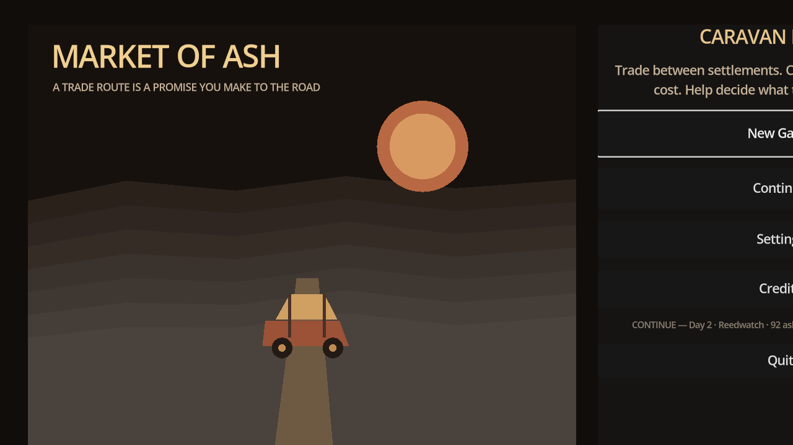
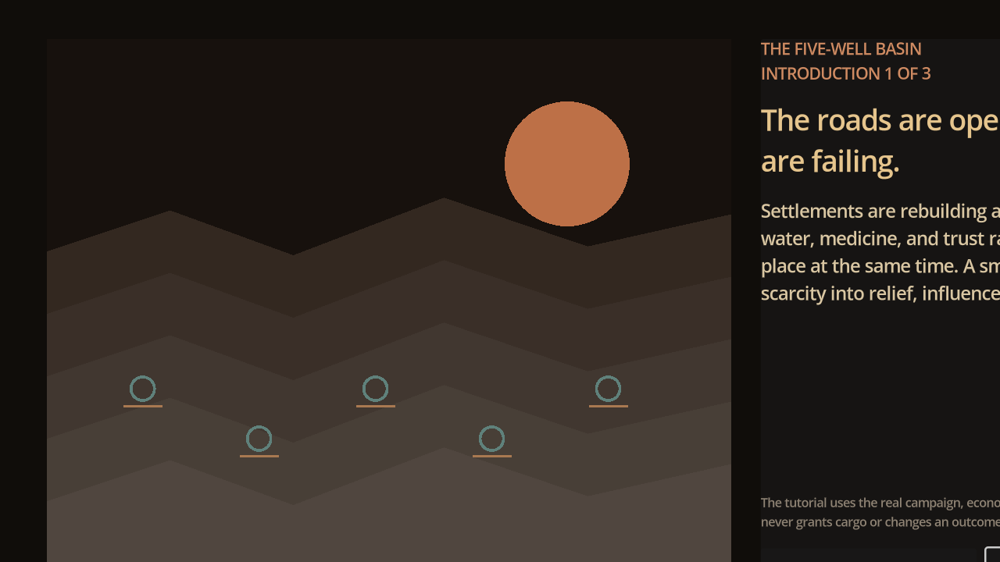
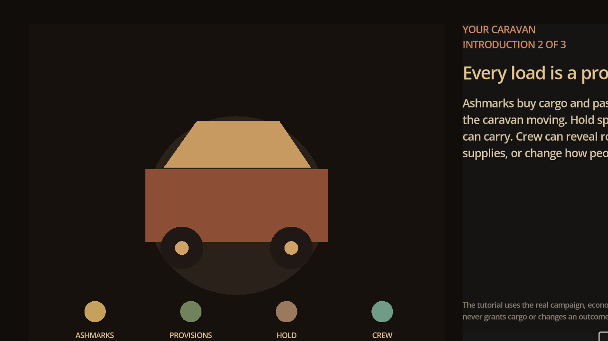

# Market of Ash — Latest Main Test Report

## Build and verification

| Field | Result |
|---|---|
| Branch tested | `origin/main` |
| Build | `v0.12.0-alpha-quality` |
| Engine | Godot 4.4.1 |
| Visual test display | 1280×720 Xvfb display |
| Automated verification | PASS: repository policy, content validators, economy, map UI, tutorial, controller, campaign, and game-quality suites |
| Runtime smoke | PASS: project launched and advanced through the title into the introduction |

## Captured evidence

The screenshots were captured from the actual latest main build and are stored under [`docs/visual_evidence/v0.12.0-alpha-quality-latest-test-2026-08-30/`](visual_evidence/v0.12.0-alpha-quality-latest-test-2026-08-30/).

## Findings

The deterministic economy and campaign verification are in good shape. The title screen is legible in its left content area and successfully exposes the trade-route premise. The major visible issue is responsive composition at 1280×720: the right-side menu and introduction panel extend beyond the visible viewport, clipping headings, body copy, and controls. This is a player-facing quality failure even though the automated suites pass.

## Next roadmap steps

### Market Quality 1 — Responsive shell repair

Implement a responsive presentation contract for 1280×720, 1600×900, and the minimum supported window. At narrow widths, the right-side panel must either reflow below the illustration or use a deliberate single-column layout. No required heading, explanation, or primary action may be clipped. Add deterministic UI assertions for panel bounds and a capture at each supported viewport.

### Market Quality 2 — Bazaar and introduction comprehension pass

Retest the introduction-to-Bazaar handoff with a fresh player. The first Bazaar view must answer what is needed here, what is profitable now, what cargo can be carried, and what the next action is without relying on prior knowledge. Preserve ordinary buying and selling as a complete path; contracts remain optional.

### Market Quality 3 — Full journey evidence capture

Capture a complete representative sequence at 1600×900: introduction, Bazaar, Departure, road observation, event, arrival/debrief, and return Bazaar. Store it under a new versioned directory and compare it against the current 1280×720 evidence before adding new content.

### Market Quality 4 — Human validation gate

Run the existing moderated comprehension protocol. Do not advance to new factions, goods, or endings until players can independently identify a profitable ordinary trade, explain the route risk, and return to market after an event.

## Evidence interpretation

This report records an internal alpha test. It is suitable for development history and Kickstarter archive material, but it is not evidence of final art, final layout, or release readiness.
