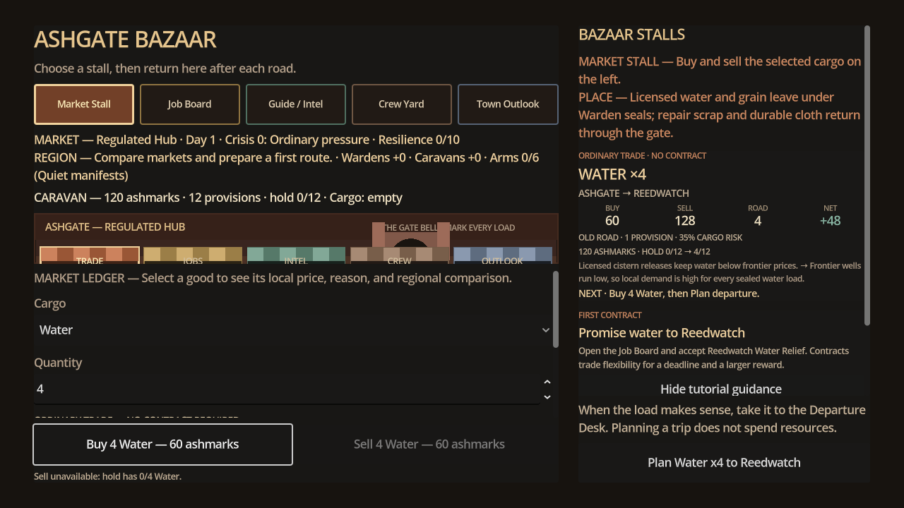
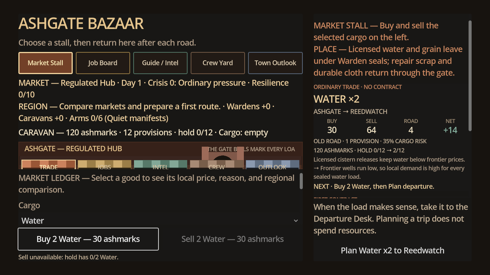

# Market of Ash — Bazaar Trade Ticket Visual Review

**Build:** `v0.13.3-alpha-basin-vertical-slice`

**Engine:** Godot 4.4.1

**Capture:** Local macOS OpenGL real renderer at 1280×720 and 1600×900.

## Finding

The 0.13.2 Bazaar was functionally complete and bounds-safe, but its first decision appeared as a small-font paragraph among tutorial and settlement prose. Buy, sell, road, and expected-net values were present without a strong scan order, leaving the Market Stall closer to a diagnostic ledger than a finished game-facing choice.

## Resolution

The selected trade is now a ticket: cargo and journey first, four comparable financial values second, then route/risk, cash/capacity, source-to-need reason, and one next action. Losing routes keep the same structure and remain selectable. The detailed market explanation remains in the left ledger, and the complete decision remains available as plain accessibility text.

## Evidence

Both capture runs passed the native viewport, required-control, focus, and state-transition validator.

## Remaining visual limitation

The procedural settlement and road illustrations establish identity and navigation but are not final commercial art. The next visual pass should be driven by player evidence rather than adding unvalidated ornament.
