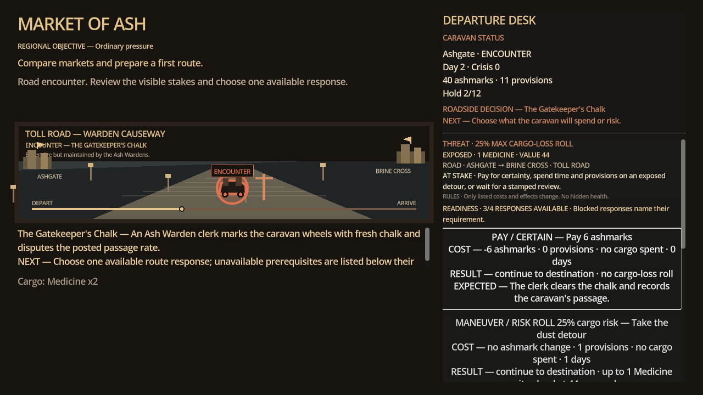

# Market of Ash — Current Presentation Visual Review

**Build:** `v0.13.4-alpha-basin-vertical-slice`

**Engine:** Godot 4.4.1

**Capture:** Local macOS OpenGL real renderer at 1280×720 and 1600×900.

## Current finding

The roadside encounter rail repeated its title and setup after those details were already visible in the persistent journey status and beside the road illustration. The repeated prose pushed response cards lower in the scrollable rail, weakening the relationship between the visible threat and the player's immediate tactics.

## Current resolution

Encounters now lead with a compact dossier: maximum cargo-loss roll, exposed cargo/value, route, authored dilemma, any frozen material or shortage basis, the explicit no-hidden-health boundary, and response readiness. Duplicate rail title/setup copy is removed. Every response retains its full disclosed cost, arrival behavior, cargo exposure, expected outcome, and blocked prerequisite.

## Current evidence

Both capture runs passed the native viewport, required-control, focus, and state-transition validator.

## Previous correction

The 0.13.3 Bazaar trade ticket replaced its paragraph-like decision summary with a cargo/journey header and separate Buy, Sell, Road, and Net values. Profitable and losing routes retain the same information hierarchy and the complete plain-text accessibility summary.

## Remaining visual limitation

The procedural settlement and road illustrations establish identity and navigation but are not final commercial art. Further art-direction work should be driven by player evidence rather than unvalidated ornament.
