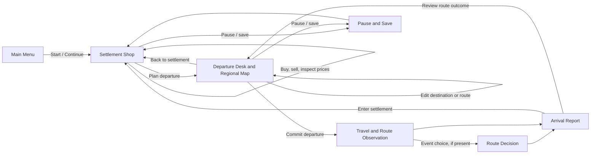
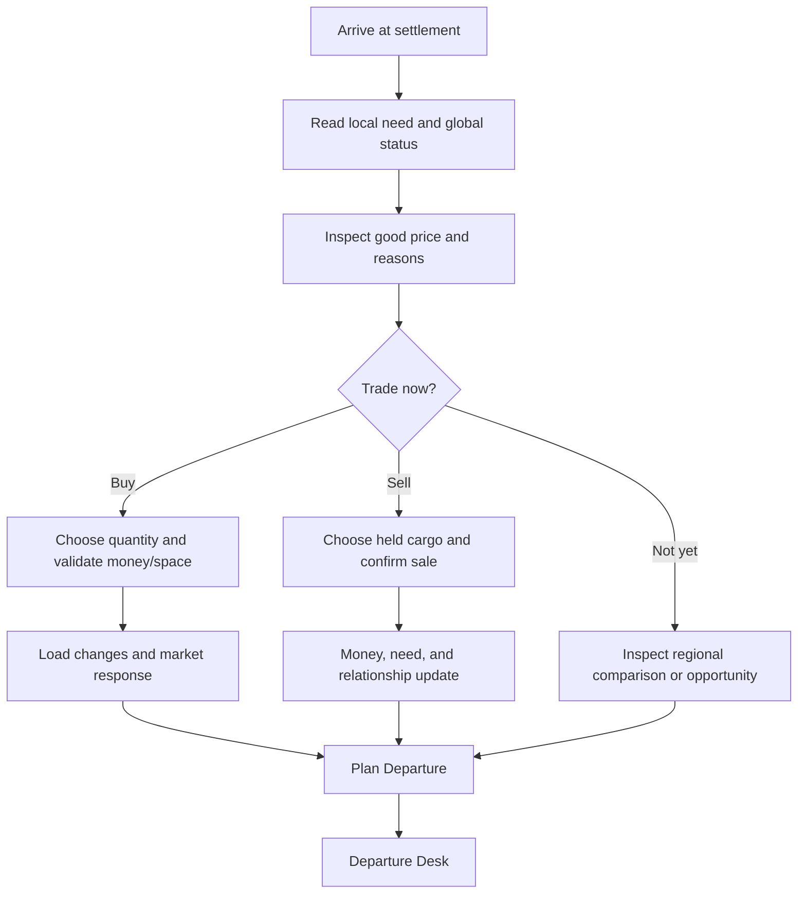
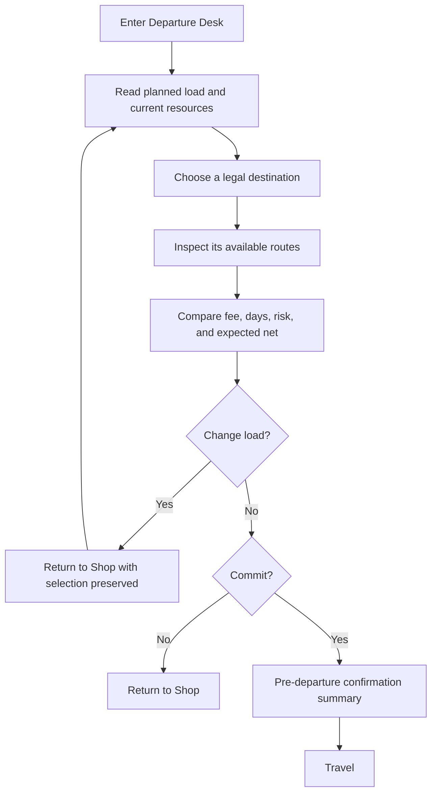

# Market of Ash — Alpha Experience Flow and UX Polish Specification

**Author:** Manus AI  
**Status:** Approved implementation direction for the alpha playtest  
**Scope:** The five-settlement, single-region trade-and-travel loop. This document does not add factories, real-time combat, infinite maps, multiplayer, or weapons-first progression.

> **UX promise:** The player is always able to answer three questions without leaving the current decision context: **Where am I? What am I committing? What could this change?**

## 1. Design Thesis

Market of Ash should not feel like a spreadsheet placed over a map. It should feel like operating a small caravan through a region that remembers trade. The shop is the player’s **home state**: it is where a settlement has a face, a need, a market, and an immediate opportunity. The departure screen is the **commitment state**: it is where a load becomes a plan with a destination, a route, visible costs, and an uncertain consequence. Travel and arrival close the loop by returning a changed caravan to another human place.

This is inspired by the useful structure of Frontier-style play—local preparation, deliberate navigation, constrained commitment, and visible arrival—without inheriting the historical interface’s density. The player should be free, but never abandoned in a wall of unrelated controls.[1] [2]

| Non-negotiable | UX consequence |
| --- | --- |
| **Commerce is the main verb.** | The first actionable screen after launch and arrival is the shop. The map is entered to commit a planned trade, not to replace market decision-making. |
| **Every important number is explainable.** | Prices, capacity, money, provisions, route fees, risk, time, and expected outcome expose a plain-language reason and comparison. |
| **Cheap routes create vulnerabilities.** | The departure screen compares cost, time, exposure, and expected loss side by side before a player commits. |
| **Failure is recoverable.** | A bad trade or route incident returns an actionable arrival state with a next step, never a dead-end modal or unexplained loss. |
| **Politics and people deepen commerce.** | Contracts, faction leverage, crew, and local needs appear as trade modifiers, service offers, or route options—not as a separate lore menu. |
| **No forced weapons path.** | Escorts, route intelligence, negotiation, cargo choice, and relationship actions are parallel ways to manage risk. |

## 2. Experience Architecture

The player sees **one dominant question per screen**. The shop asks, *“What changes hands here?”* The departure desk asks, *“Is this trip worth taking?”* Travel asks, *“What will I give up, protect, or change now?”* Arrival asks, *“What changed, and what do I do with it?”*

## 3. Global Interaction Rules

The game uses a consistent information hierarchy. A stable top rail always shows **day, current settlement, ashmarks, provisions, hold used/capacity, crisis condition, and autosave state**. It uses both color and words: rust means exposed, faded blue means water pressure, bone means neutral, and gold marks the current recommended or selected action. No critical state is encoded by color alone.

Primary actions are singular and verbs-first. Each screen has one visually strongest action: **Plan Departure** in the shop, **Commit Departure** on the map, **Resolve Choice** during an event, and **Enter Settlement** at arrival. A secondary back action is always available. Destructive, expensive, or irreversible actions disclose their immediate cost immediately before confirmation.

Every response should acknowledge cause and effect in the same format: an outcome headline, a number delta, the reason, and the next available action. For example: *“Old Road incident — 1 water lost. The route’s exposed condition made a cargo loss possible. You reached Reedwatch with 6/7 water.”* This explanation belongs near the result, not buried in a log.

## 4. Screen Contracts

### 4.1 Main Menu

| Element | Purpose | Alpha behavior | Polish requirement |
| --- | --- | --- | --- |
| **Start Game / Continue** | Enter a deterministic first-run preset or validate and restore an existing campaign. | Starts Ashgate, day one, 120 ashmarks, 12 provisions, and empty cargo; Continue is separately enabled when a save exists and shows save status. | Add multiple save slots only if playtesting demonstrates a need. |
| **Quick Playtest card** | Explain the test state and avoid false promises. | States the first-run preset and optional grain learning move. | Shows estimated loop length and what feedback is being tested. |
| **Settings** | Make comfort and control discoverable before play. | Main Menu exposes large text, reduced motion, and mouse/keyboard/controller guidance. | Add audio, runtime remapping, and persisted accessibility preferences. |
| **Quit** | Give a conventional, safe exit. | Desktop-only. | Confirms only if unsaved changes exist; never presents an intrusive quit prompt during the first minute. |

### 4.2 Settlement Shop — the central screen

The shop is a quiet local scene with a readable market desk in the foreground. It carries settlement identity through a banner color, silhouette, ambient sound, two or three animated trade details, and a short **“today’s need”** sentence. It is not a pure inventory screen.

| Zone | Player question | Alpha content | Future polish |
| --- | --- | --- | --- |
| **Settlement header** | Where am I and why does it matter? | Settlement name, role, day, crisis state, local one-line need. | Market banner, local NPC portrait, faction mark, arrival animation, contextual ambient sound. |
| **Market ledger** | What is worth buying or selling? | Goods list, unit price, selected load cost, short price reason, regional comparison. | Icons, supply/demand arrows, price-change badges, rumors, stale-information markings, contract pins. |
| **Caravan load** | What do I hold and what room remains? | Hold used/capacity, cargo rows, selected quantity, ashmarks, provisions. | Drag/reorder option, cargo risk/spoilage tags, reserve-space indicator, clear estimated sale destinations. |
| **Local opportunities** | What else can I do here? | Not yet interactive; a compact placeholder label only if required. | Contracts, services, crew, rumors, faction permits, debt/obligation cards. One is spotlighted, never a wall. |
| **Action rail** | What is my next meaningful action? | Buy cargo, sell cargo, optional guided purchase, **Plan Departure**, save, reset. | Disabled-state explanations, keyboard hints, controller glyphs, one-click repeat buy/sell, safe undo only before departure. |
| **Outcome ribbon** | What just changed? | Last command result and cargo summary. | Animated deltas, new rumor badges, world-change callouts, “why this mattered” expansion. |

**Shop interaction flow**

The key alpha rule is **no map visible behind buying and selling controls**. The player can make a local trade decision without scanning a competing route image. The button **Plan Departure** carries the currently selected good and quantity as a planning context; it does not execute travel.

### 4.3 Departure Desk — map and commitment screen

The departure desk is entered by a visible transition: the market foreground falls away, the regional map becomes the dominant surface, and the caravan ledger anchors the right side. The screen visually communicates that the player is no longer merely browsing; they are considering an action that consumes time and provisions.

| Zone | Player question | Alpha content | Future polish |
| --- | --- | --- | --- |
| **Map canvas** | Where can I actually go? | Five-Well Basin, settlement marks, canonical route corridors, caravan marker, selected destination highlight. | Zoom, pan, route condition overlays, faction borders, weather/ash visibility, discovered rumors, contract destinations. |
| **Route cards** | Which road fits this plan? | Destination selector, legal route selector, fee, days, risk, route description. | Route state chips: guarded, washed out, watched, scouted, toll raised, caravan traffic. |
| **Load context** | What am I risking? | Selected planning good and quantity; current cargo/hold. | Cargo-value-at-risk, spoilage, contract obligations, crew/escort mitigation, “leave behind” decision. |
| **Forecast ledger** | What do I expect to gain or lose? | Purchase, expected sale, gross margin, route fee, provisions, time, expected loss, expected net. | Range/uncertainty bands, source of uncertainty, alternative route comparison, what changes the forecast. |
| **Commitment rail** | Am I ready to leave? | **Commit Departure**, Return to Shop, save/reset. | One final summary sentence; hold-to-confirm option; pre-departure autosave; explicit irreversibility marker. |
| **Route outcome layer** | What happened on the road? | Caravan movement and command result. | Traveling audio, animated route pulse, event card, summary of resource deltas, pause/save policy. |

**Departure interaction flow**

No departure should be blocked without explaining **why** and offering the next action. Examples include: *“The Toll Road connects Ashgate to Brine Cross, not Reedwatch. Select Reedwatch to take the Old Road.”* and *“You need 4 ashmarks for the Old Road fee after loading grain. Reduce the load or return to the shop.”*

### 4.4 Travel and Route Events

Travel must be short enough to respect the player’s time and rich enough to make a committed route memorable. The map animation is the container, not the entire experience. The alpha should show a route start, a midpoint observation, and an arrival result; later event cards pause only when a genuine decision exists.

| Moment | Player feedback | Required rule |
| --- | --- | --- |
| **Departure** | Route line lights, caravan leaves settlement, fee/provisions animate out. | Show the actual selected route, not a generic loading screen. |
| **Midpoint observation** | One short route condition message or event setup. | If no decision is available, it must still explain a visible risk/condition. |
| **Event choice** | A compact card with at least two plain-language choices and outcome stakes. | Use cargo, crew, money, reputation, or a deliberate sacrifice; do not add opaque random failure. |
| **Resolution** | Delta line plus causal reason; route continues or arrives. | Do not hide an important loss in flavor text. |
| **Arrival** | Settlement banner, final cargo, money/provisions/day changes, new local need. | Return to an actionable shop state, not a dead-end end card. |

### 4.5 Arrival and Reinvestment

Arrival should take less than five seconds to comprehend. The player sees: **where they are, what survived, what they gained/lost, what has changed locally, and the primary next action**. Pressing **Enter Settlement** returns to the central shop. A small expandable route report can remain available for players who want exact deltas.

The first arrival after a route incident must distinguish planning failure from pure bad luck. For example: *“You chose the exposed Old Road: its warning was visible, and the incident cost one grain. Reedwatch is still paying a premium for water.”* The message gives the player agency without moralizing.

## 5. Supporting User Flows

### 5.1 First-run learning path

The first run is guidance, not a script. The shop highlights the Grain price card, explains the optional 2-grain example, and calls out **Plan Departure** only after the player has inspected or made a trade. The departure desk begins with Reedwatch and Old Road selected, but the player can freely compare Brine Cross/Toll Road or return to change cargo. The guidance completes only when a player has seen a forecast, bought or chosen not to buy, committed a route, and reached an arrival state.

### 5.2 Returning-player loop

A returning player should resume in the settlement shop with a quiet **Since your last visit** strip: regional crisis change, route condition change, local market response, one active contract or rumor, and an autosave time. They should be one click from either inspecting the selected market good or opening the departure desk.

### 5.3 Contract flow

A contract begins as a card in the local opportunity zone, not a modal interruption. It declares destination, deadline, minimum delivery, reward, relationship change, and visible failure condition. Accepting a contract pins its destination in the departure desk and adds a cargo marker to the ledger. Contract resolution occurs on arrival before ordinary sale, and the player can explicitly renegotiate when supported.

### 5.4 Crew and service flow

Crew and services are settlement-scoped offers. A player opens a compact panel from the shop, reads the cost and the trade consequence, commits or backs out, and returns to the same shop state. A scout should change route information; a quartermaster should change provisions; a fixer should change a social/contract option. The flow must not become a separate management game.

### 5.5 Recovery flow

After an unprofitable trade or route loss, the arrival report highlights **recovery options** that actually exist: sell remaining cargo, take a small local contract, choose a safer return route, ask a contact for information, or wait only when waiting changes something visible. Recovery messaging is concrete: *“You lost 1 water, but Reedwatch still offers two sellable goods and a cheap route back through Hollow Market.”*

### 5.6 Save, pause, and settings flow

Pause is always available from the global rail. Save state is visible but quiet: an icon changes from *Saved* to *Saving* to *Saved at Reedwatch, Day 3*. Manual Save creates no surprise overwrite; Load presents settlement/day/cargo/money summaries. Settings use immediate preview for audio/text scaling and preserve focus/device selection when returning to play.

### 5.7 Invalid action and accessibility flow

When action preconditions fail, controls remain visible but communicate the reason in place. Keyboard focus, controller focus, and mouse hover surface the same tooltip. Error language names both the missing condition and a possible recovery step. Motion-reduction disables map camera movement and replaces travel animation with a legible progress sequence; text scaling preserves the action rail and never clips price reasons.

## 6. Alpha Navigation Model

| From | Primary action | To | State carried forward | Must not happen |
| --- | --- | --- | --- | --- |
| Main Menu | Start Game | Settlement Shop | Deterministic starting state | Map shown before the player understands the starting market. |
| Settlement Shop | Plan Departure | Departure Desk | Selected good, quantity, cargo, money, provisions | Buying/selling or travel accidentally executes. |
| Departure Desk | Return to Shop | Settlement Shop | Destination/route selection may persist; no resource changes | Player loses planning context. |
| Departure Desk | Commit Departure | Travel | Canonical route, destination, active cargo, forecast snapshot | Cost/risk differs from displayed route. |
| Travel | Resolve event / continue | Arrival Report | Command result and deltas | Generic loading screen hides an incident. |
| Arrival Report | Enter Settlement | Settlement Shop | Current settlement, resources, changed world state | Player is left without a clear next action. |
| Any gameplay screen | Pause | Pause/Save | Existing screen and selection | Save/load changes simulation outside command boundaries. |

## 7. UX Polish Backlog

The following sequence protects the core loop before visual scale.

| Priority | Slice | Definition of done | Validation question |
| --- | --- | --- | --- |
| **P0** | Shop/departure separation | No map behind trade controls; departure map is entered via a dedicated button; valid route forecast/commit controls live on the map screen. | Can a first-time player describe the difference between buying and committing travel? |
| **P0** | Arrival report | Every departure produces a clear route result and a one-click return to the destination shop. | Can a player name what changed after a trip without opening a log? |
| **P0** | Cost/risk explanation | Forecast is consistent with resolver; risks name source and consequence. | Does the player trust the forecast after an incident? |
| **P1** | Settlement identity | Each settlement has a banner, local need, icon language, and short arrival feedback. | Can the player identify where they are at a glance? |
| **P1** | Contracts and local opportunity cards | At least one trade-linked alternative objective per relevant settlement. | Does a relationship-driven plan coexist with profit seeking? |
| **P1** | One meaningful route event | Route event uses visible preparation and offers two understandable choices. | Does travel feel like more than a transition? |
| **P1** | Input/accessibility pass | Full keyboard/controller focus order, text scaling, tooltips, color-safe status. | Can a player complete a run without a mouse or color-only information? |
| **P2** | World reaction layer | Market, banner, route, and NPC reaction show consequences. | Does the player perceive regional memory before opening a report? |
| **P2** | Audio and microfeedback | Layered ambience and restrained purchase/travel/result sounds. | Does the game feel responsive without becoming noisy? |
| **P2** | Long-session polish | Autosave, safe save migration, error handling, analytics-free crash capture. | Can a player play 30–60 minutes without losing progress or context? |

## 8. Acceptance Criteria for the Implemented P0 Refactor

The playable prototype meets this UX slice when the following statements are true.

| Criterion | Verification |
| --- | --- |
| Launch presents a main menu and Start Game opens **Settlement Shop**, not the map. | UI smoke test and browser build visual check. |
| Shop contains only local trade, local context, cargo, the current market explanation, and a **Plan Departure** action. | UI smoke test verifies shop visibility and map hidden. |
| Plan Departure opens a dedicated **Departure Desk** with map, legal destinations/routes, selected load context, forecast, Return to Shop, and Commit Departure. | UI smoke test verifies visibility/state preservation. |
| Returning from the map changes no world resource or command history. | Serialization equality test. |
| Commit Departure retains authoritative route validation and begins presentation travel. | Economy test and UI smoke test. |
| Every arrival presents a clear result and an explicit path back to the settlement shop. | UI smoke test and manual interaction check. |
| No existing deterministic economy or save contract changes solely because of screen layout. | Existing headless economy suite remains green. |

## Sources

[1]: https://ffeartpage.com/pdf/ffestart.pdf "How To Start Frontier: First Encounters"
[2]: https://gamefaqs.gamespot.com/cd32/971966-frontier-elite-ii/faqs/80509/introduction "Frontier: Elite II — Guide and Walkthrough"
