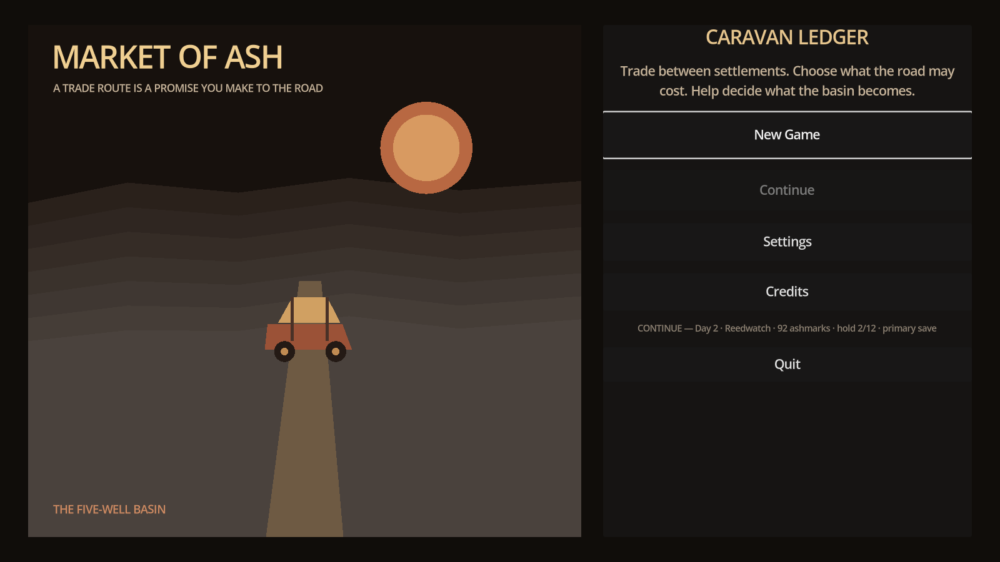
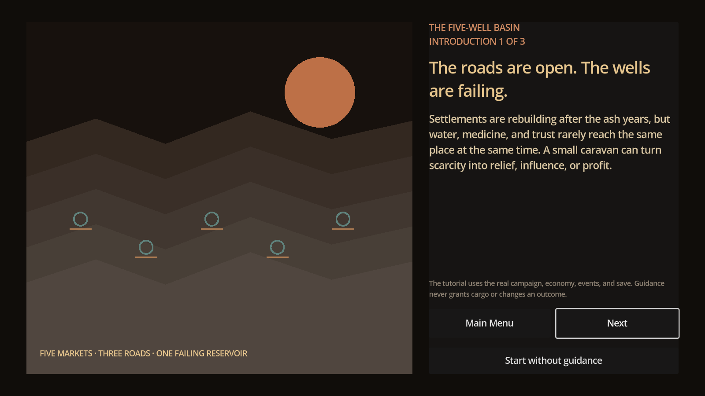
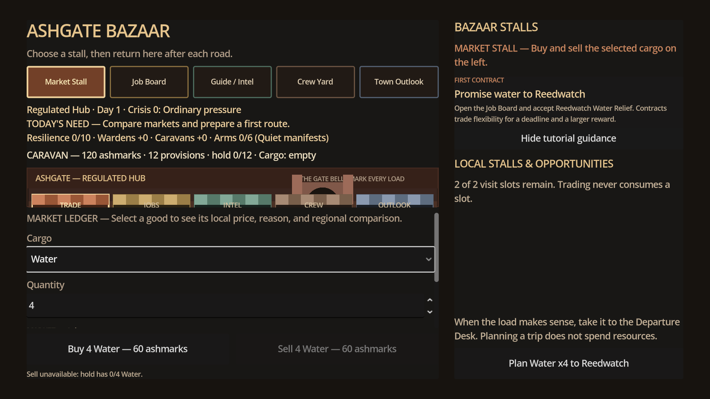
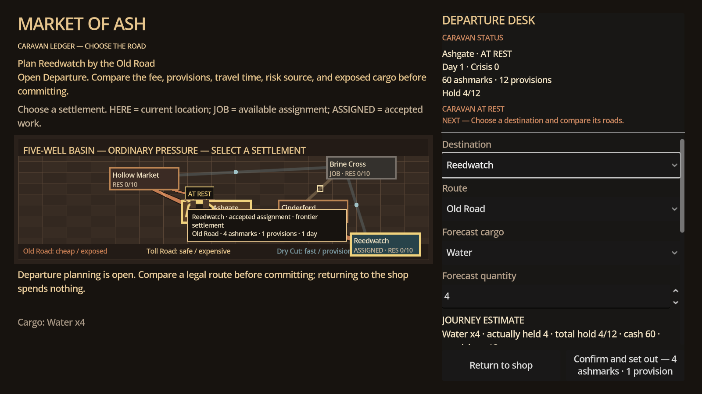
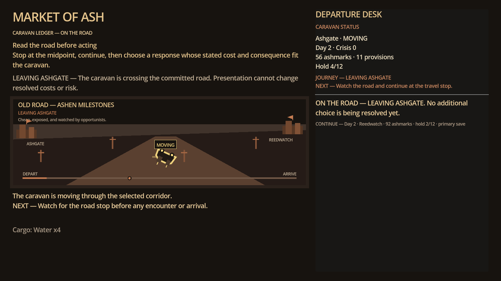
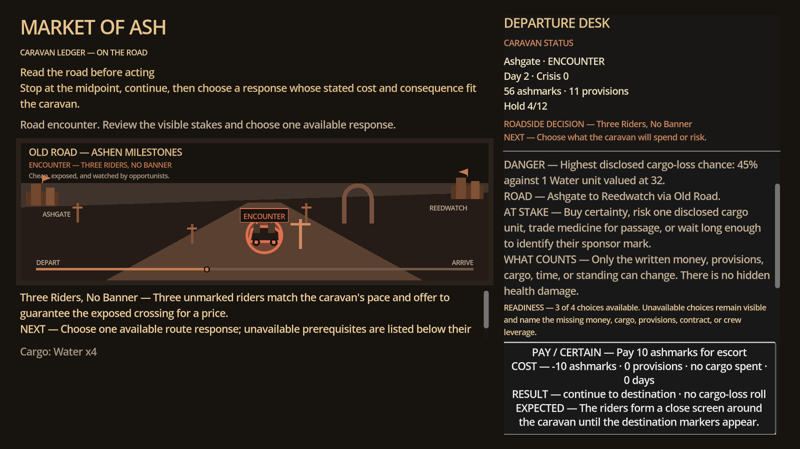
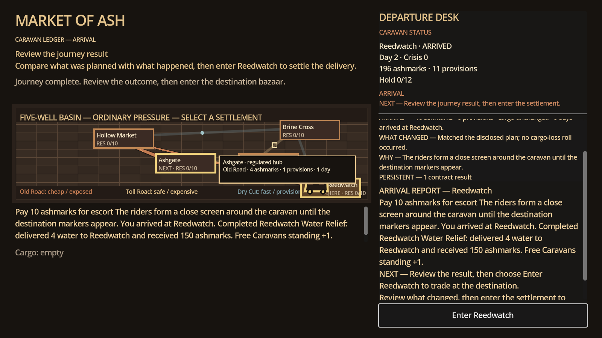

# Market of Ash — Visual Evidence Gallery

This gallery preserves the strongest screenshots from the `v0.12.0-alpha-quality` visual audit as dated development evidence. These are prototype/alpha captures, not final promotional key art. They are useful for showing progression, design intent, and the evolution from technical prototype toward a polished Frontier-inspired trade-and-travel RPG.

## Capture record

| Field | Value |
|---|---|
| Build | `v0.12.0-alpha-quality` |
| Capture set | Latest UI audit from the game-quality vertical-slice review |
| Logical presentation | 1280×720 design canvas; desktop target 1600×900 |
| Capture scope | Main Menu, introduction, Bazaar, Departure, road observation, event, arrival handoff |
| Evidence status | Existing internal development screenshots; exact capture timestamp was not preserved |

## Screenshots

### Main Menu

The title establishes the ash-frontier setting and presents the entry into the journey.

### Introduction

The introduction communicates the game’s trade-and-travel premise before the player reaches the market.

### Bazaar

The Bazaar is the central commerce screen: local needs, price information, cargo, and the player’s trade thesis are brought together.

### Departure map

The Departure state shows route choice, distance, risk, and the relationship between a settlement and the wider basin.

### Road observation

The road view demonstrates the intended rhythm between planning, uncertainty, and the next arrival.

### Event

The event state shows how a roadside decision interrupts trade without replacing the wider economic loop.

### Arrival handoff

The arrival state closes one journey and hands the player back into settlement commerce and recovery.

## Kickstarter bonus-content framing

A Kickstarter campaign could present this set as **“The Basin Takes Shape: Alpha Screenshots”**. The strongest bonus-content promise is not that these images are finished art; it is that backers can see the actual design process: how a market, route, event, and arrival connect into one deterministic trading journey.

Recommended reward language is “development archive access” or “digital production journal,” including versioned screenshots, short design commentary, and selected before/after comparisons. Avoid promising unreleased features, final art, a fixed launch date, or a complete campaign until those items have passed human testing and owner approval.

The repository’s binding economic design remains in [`docs/design/nonlinear_trade_and_adaptive_basin_addendum.md`](design/nonlinear_trade_and_adaptive_basin_addendum.md). Ordinary buying and selling must remain valuable; contracts are optional pressure, not a mandatory quest rail.
