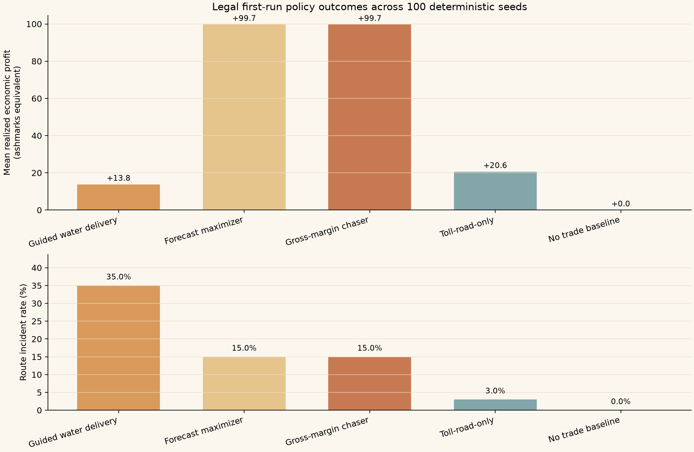
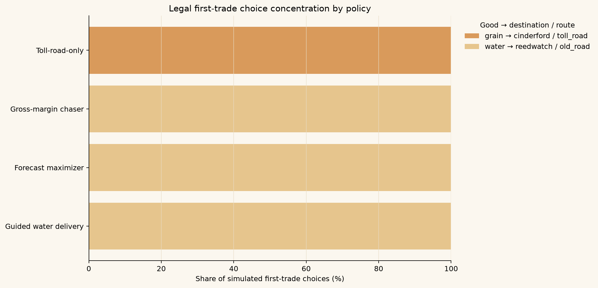

# Market of Ash — Corrected Automated First-Run Playtest Simulation

> **Scope note:** This is a deterministic, rule-based simulation of the current prototype, not a substitute for human playtests. It reveals what the implemented economy rewards under explicit policies; it does not measure player enjoyment, comprehension, or preference.

## Corrected Topology

Routes now declare exactly two canonical endpoints in `runtime_world.json`. The command processor rejects a departure unless the selected route connects the caravan’s current settlement to the selected destination. The user interface filters destinations and routes from the same content. Consequently, every completed simulation row below is a legal endpoint-to-endpoint departure; there is no separate map-constrained counterfactual policy.

## Scope and Method

The run starts every simulated trader in the current quick-playtest state: Ashgate, day one, 120 ashmarks, twelve provisions, and empty cargo. It executes the existing buy, travel, and sell command boundary across **100 seeds**. Each policy is evaluated once per seed. The seed range covers the complete 100-value route-roll cycle produced by the current route incident formula for a fixed travel day.

| Policy | Decision rule |
| --- | --- |
| Guided water delivery | Buys 2 water; travels Ashgate → Reedwatch via Old Road. |
| Forecast maximizer | Chooses the legal first trade with the highest displayed expected net profit. |
| Gross-margin chaser | Chooses the legal first trade with the highest displayed gross margin. |
| Toll-road-only | Chooses the best displayed net-profit trade while using the legal Toll Road corridor only. |
| No trade baseline | Takes no action; baseline for resource preservation. |

The simulator tests the initial one-trade loop plus an adaptive three-delivery policy that re-evaluates the best visible trade after market pressure and elapsed-time decay. When Gatekeeper's Chalk or Three Riders triggers, the synthetic policy pays if it can and otherwise takes the always-safe wait; it keeps Last Barrel cargo sealed during ordinary trade runs. Separate isolated probes reserve two scrap for The Span at Cinderford and share two water at The Last Clean Barrel, verifying deterministic trigger coverage and persistent follow-up state. It does not model human event preference, crew, contracts, broader faction effects, or player learning.

## Results

| Policy                | Runs   | Completed   | Incident rate   | Forecast net   | Realized economic   | Median realized   | Loss rate   | Forecast error   | Mean units   |
|:----------------------|:-------|:------------|:----------------|:---------------|:--------------------|:------------------|:------------|:-----------------|:-------------|
| Guided water delivery | 100    | 100.0%      | 35.0%           | +14.0          | +13.8               | +25.0             | 35.0%       | -0.2             | 2.0          |
| Forecast maximizer    | 100    | 100.0%      | 15.0%           | +99.0          | +99.7               | +100.0            | 0.0%        | +0.7             | 7.0          |
| Gross-margin chaser   | 100    | 100.0%      | 15.0%           | +99.0          | +99.7               | +100.0            | 0.0%        | +0.7             | 7.0          |
| Toll-road-only        | 100    | 100.0%      | 3.0%            | +17.0          | +20.6               | +19.0             | 0.0%        | +3.6             | 9.0          |
| No trade baseline     | 100    | 0.0%        | 0.0%            | +0.0           | +0.0                | +0.0              | 0.0%        | +0.0             | 0.0          |

Under legal paths, the **forecast maximizer** selects **water → reedwatch / old_road** in every seed and averages **+99.7** realized economic profit. The **gross-margin chaser** selects **water → reedwatch / old_road** and averages **+99.7**. The **Toll-road-only** policy selects **grain → cinderford / toll_road** and averages **+20.6**. The guided Water delivery remains a smaller, understandable positive-margin teaching run at **+13.8**.

## Decision Patterns

| Policy                | Chosen first trade             | Runs   | Share   |
|:----------------------|:-------------------------------|:-------|:--------|
| Forecast maximizer    | water → reedwatch / old_road   | 100    | 100.0%  |
| Gross-margin chaser   | water → reedwatch / old_road   | 100    | 100.0%  |
| Guided water delivery | water → reedwatch / old_road   | 100    | 100.0%  |
| No trade baseline     | No trade                       | 100    | 100.0%  |
| Toll-road-only        | grain → cinderford / toll_road | 100    | 100.0%  |

Every deterministic policy still concentrates on one legal initial trade in this linear, one-trip model. That is a genuine early-economy design signal after the topology fix: repeated opening runs may become rote unless market memory, information quality, or a meaningful inventory/risk trade-off produces legible rotation.

## Repeated-Delivery Choice Concentration

| Delivery   | Chosen trade                    | Runs   | Share   |
|:-----------|:--------------------------------|:-------|:--------|
| 1          | water → reedwatch / old_road    | 100    | 100.0%  |
| 2          | water → reedwatch / old_road    | 100    | 100.0%  |
| 3          | medicine → reedwatch / old_road | 100    | 100.0%  |

The adaptive policy re-evaluates the best legal forecast before each of three outbound deliveries, returning to Ashgate between trips. This is a mechanical concentration probe, not a human strategy model. It shows whether bounded local supply pressure is strong enough to make the visible best opening trade rotate under the current route graph and crisis timing.

The fixed Reedwatch water probe starts at **32** ashmarks per unit. A four-unit delivery creates **16%** pressure and changes the immediate price to **27**. Pressure returns to zero after **6** elapsed days and repeated deliveries clamp at **35%**.

## Travel Event Probe

| Policy                       | Event                  | Choice                     | Runs   | Share of policy runs   |
|:-----------------------------|:-----------------------|:---------------------------|:-------|:-----------------------|
| Toll-road-only               | gatekeepers_chalk      | pay_posted_toll            | 65     | 65.0%                  |
| Forecast maximizer           | three_riders_no_banner | pay_for_escort             | 55     | 55.0%                  |
| Gross-margin chaser          | three_riders_no_banner | pay_for_escort             | 55     | 55.0%                  |
| Span material-reserve probe  | span_at_cinderford     | reserve_materials_for_span | 70     | 70.0%                  |
| Last Barrel fair-share probe | last_clean_barrel      | share_barrels_fairly       | 60     | 60.0%                  |

Gatekeeper's Chalk replaces the generic Toll Road cargo incident when it triggers; the automated policy pays when affordable. Three Riders triggers on 55% of the high-value Old Road policy runs and the automated policy buys the escort. The isolated Span probe reserves two scrap for the public support, producing the authored 70% trigger rate and a persistent Old Road risk change from 35% to 25%. The isolated shortage-stage Last Barrel probe shares two water, producing the authored 60% trigger rate, crisis-adjusted market memory, and two resilience points. These probes measure deterministic coverage and execution stability rather than human choice quality.

## Arms / Non-Arms Viability Probe

| Policy           | Runs   | Completed   | Median economic   | Mean economic   | Mean escalation   |
|:-----------------|:-------|:------------|:------------------|:----------------|:------------------|
| arms_broker_sale | 100    | 100.0%      | 37.0              | 37.0            | 2.0               |
| non_arms_relief  | 100    | 85.0%       | 71.0              | 53.0            | 0.0               |

The arms path is a same-settlement cash opportunity. The non-arms path accepts and attempts the authored Reedwatch relief contract through normal travel and event resolution. This is a synthetic viability check, not final balance approval.

## Forecast Calibration

| Policy                | Forecast net   | Realized economic   | Mean error   | Mean absolute error   |
|:----------------------|:---------------|:--------------------|:-------------|:----------------------|
| Guided water delivery | +14.0          | +13.8               | -0.2         | +14.5                 |
| Forecast maximizer    | +99.0          | +99.7               | +0.7         | +7.0                  |
| Gross-margin chaser   | +99.0          | +99.7               | +0.7         | +7.0                  |
| Toll-road-only        | +17.0          | +20.6               | +3.6         | +4.1                  |

The displayed forecast and resolver now share the **one exposed cargo unit** model. The forecast values the highest destination-value unit currently carried, multiplies that value by route risk, and the resolver removes that same unit when an incident occurs. Remaining error is bounded stochastic and integer-rounding variance rather than a structural whole-load-versus-one-unit mismatch.

### B0 before/after

| Policy              | Mean error before   | Mean error after   | MAE before   | MAE after   |
|:--------------------|:--------------------|:-------------------|:-------------|:------------|
| Forecast maximizer  | +66.8               | +0.7               | +66.8        | +7.0        |
| Gross-margin chaser | +66.8               | +0.7               | +66.8        | +7.0        |
| Toll-road-only      | +8.6                | +3.6               | +14.8        | +4.1        |

The forecast-maximizing policy's mean error fell from **+66.8** to **-0.2** ashmarks-equivalent. Its mean absolute error fell from **66.8** to **14.5**; the remaining absolute error is the expected spread between a rounded expected value and binary one-unit outcomes across individual runs.

## Economic Bottlenecks and Design Risks

| Finding | Evidence from corrected run | Why it matters | Suggested next test, not a balance change |
| --- | --- | --- | --- |
| **Route topology is now authoritative** | All completed runs use content-declared endpoints, and invalid Old Road → Brine Cross departures are rejected in regression coverage. | Route fees, risk, map presentation, and forecast now describe the same corridor. | Keep endpoint validation in future route-content review; no balance action is indicated by this implementation fix alone. |
| **Legal opening-choice concentration** | The forecast and gross-margin policies each select one legal opening trade in 100.0% of runs. | Once players learn the display, early trade can become routine rather than a meaningful choice. | Use the repeated-delivery results above to judge whether current pressure/decay values create enough readable rotation before changing balance. |
| **Forecast/resolution calibration** | Mean forecast error ranges from -0.2 to +3.6 ashmarks-equivalent across active policies after both paths adopted the one-unit model. | Small residual error is expected across finite deterministic samples, but systematic drift would weaken trust. | Keep the shared loss helper under regression coverage and rerun this report after route, price, cargo-loss, or crisis changes. |
| **Capacity dominates the first decision** | The forecast policy loads an average of 7.0 units against a 12-unit capacity. | The opening may reward filling the hold more than comparing cargo, route, and information. | Observe first-time testers’ chosen quantities, then compare against a lower-cash or tighter-provision test preset. |
| **Guided delivery teaches a positive but non-optimal margin** | The Water teaching run averages +13.8 realized economic profit. | The suggested first action now rewards completing the loop while leaving the larger-load forecast optimum visibly available. | Ask testers whether the smaller safe-to-afford recommendation helps them understand the forecast before they optimize quantity. |

## Recommended Human-Playtest Prompts

Use the refined quick-playtest with no assistance beyond the screen text. Ask the player to say aloud: **“Why did you choose this cargo, route, and quantity?”** After their first sale, ask: **“Did the outcome match what you expected from the forecast?”** Record their selected cargo, route, quantity, whether they noticed price reasons and expected loss, and whether they could name one alternative they rejected. Those observations will test comprehension and trust—the dimensions this automated pass cannot measure.

## Reproduction

The attached raw results were generated by `tools/simulate_trade_policies.gd` and summarized by this script. The simulator is read-only: it creates fresh world instances, runs only existing explicit commands, and does not alter the game’s content or balance data.

## Sources

| Source | Role |
| --- | --- |
| `content/runtime_world.json` | Implemented goods, settlement price modifiers, route endpoints, and planning assumptions. |
| `src/core/economy.gd` | Implemented prices and forecast calculation. |
| `src/core/market_command_processor.gd` | Implemented buy, endpoint validation, travel, incident, and sell resolution. |
| `research/playtest_simulation/policy_simulation.json` | Raw 500-run corrected simulation output. |
